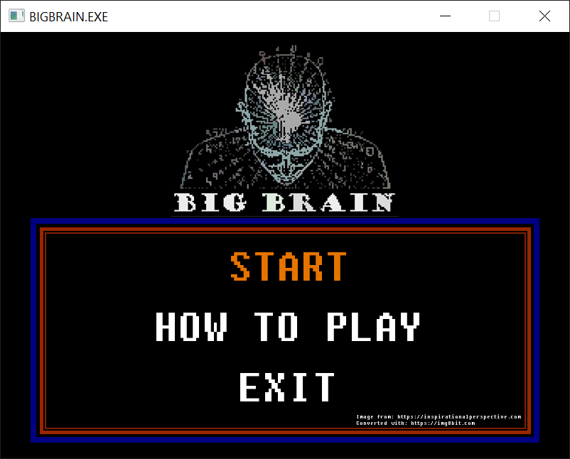
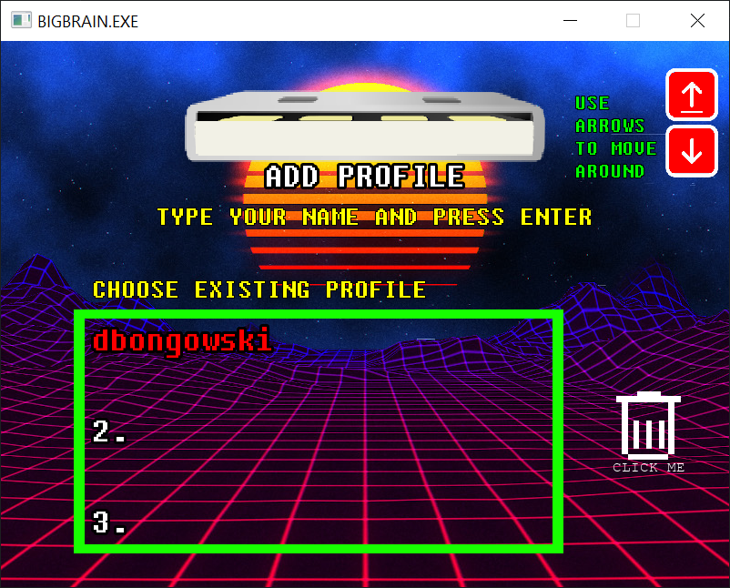
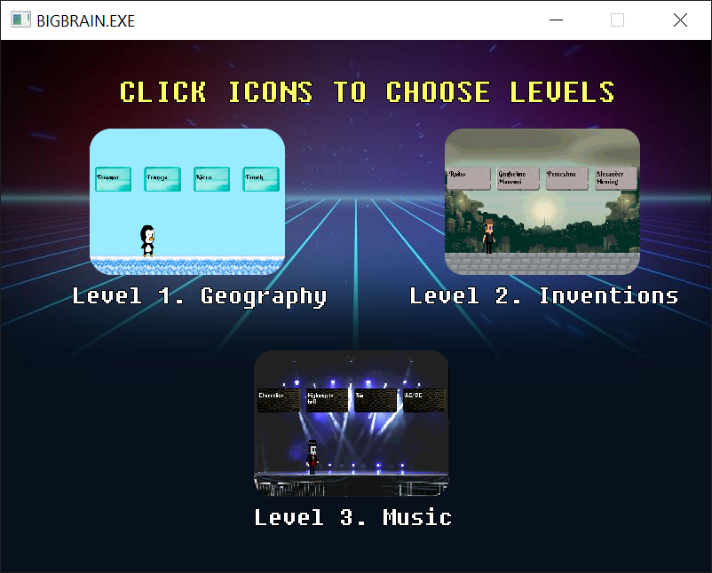
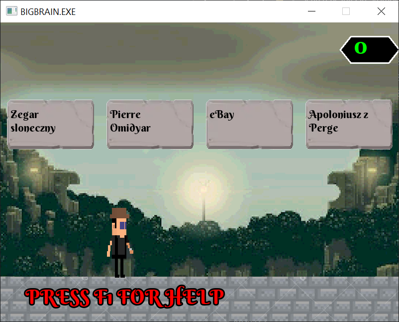
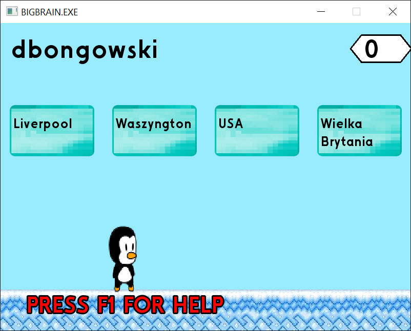
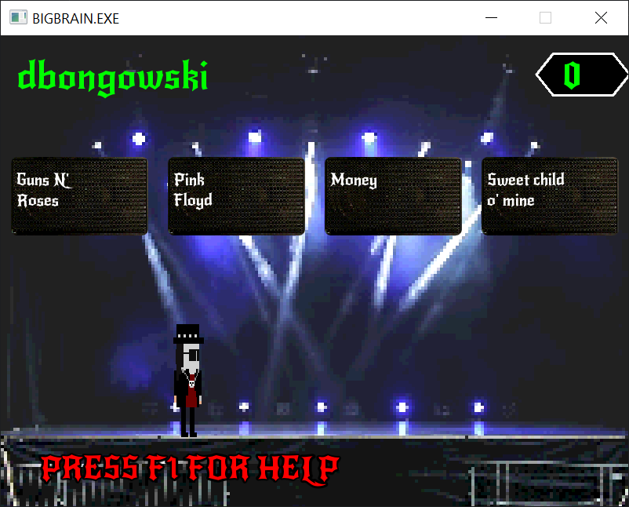

# Bigbrain Game

Welcome to the repository of Bigbrain, a 2D quiz game that challenges players to match corresponding phrases with unique gameplay mechanics. Developed in C++ and utilizing the SFML library, Bigbrain contains three stages with different characters, where answers are selected in an unusual way - by hitting the box with the character's head.

## Getting Started

To dive into the Bigbrain experience, follow these simple steps:

### Running the Game

1. **Download the Debug Folder:** Navigate to the `Debug` folder in this repository. This folder contains the executable file along with the necessary runtime libraries and resources.
2. **Launch BIGBRAIN.exe:** Inside the `Debug` folder, find and double-click the `BIGBRAIN.exe` file to start the game. No installation is required, and the game launches directly.

### Exploring the Source Code and Resources

- **Source Code:** The complete source code of the game is housed in the `BIGBRAIN` folder. Feel free to explore the code.
- **Resources:** The `res` folder contains all the additional files required by the game, such as graphics and text files. These resources are essential for the game's content.
- **Quiz content**
## Game preview

## License

This project is licensed under the [GPLv3 license](https://www.gnu.org/licenses/gpl-3.0.en.html). By contributing to this repository, you agree to license your contributions under the same license.

